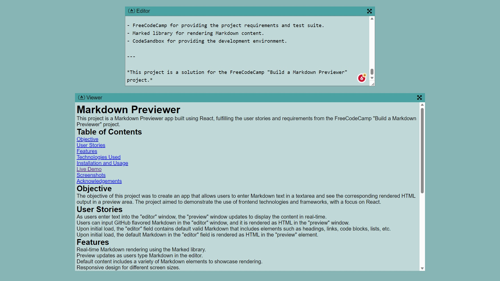

# Markdown Previewer

This project is a Markdown Previewer app built using React, fulfilling the user stories and requirements from the FreeCodeCamp "Build a Markdown Previewer" project.

## Table of Contents

- [Objective](#objective)
- [User Stories](#user-stories)
- [Features](#features)
- [Technologies Used](#technologies-used)
- [Installation and Usage](#installation-and-usage)
- [Live Demo](#live-demo)
- [Screenshots](#screenshots)
- [Acknowledgements](#acknowledgements)

## Objective

The objective of this project was to create an app that allows users to enter Markdown text in a text area and see the corresponding rendered HTML output in a preview area. The project aimed to demonstrate the use of front-end technologies and frameworks, with a focus on React.

## User Stories

1. As users enter text into the "editor" window, the "preview" window updates to display the content in real time.
2. Users can input GitHub-flavored Markdown in the "editor" window, and it is rendered as HTML in the "preview" window.
3. Upon initial load, the "editor" field contains a default valid Markdown that includes elements such as headings, links, lists, etc.
4. Upon initial load, the default Markdown in the "editor" field is rendered as HTML in the "preview" window.

## Features

- Real-time Markdown rendering using the Marked library.
- Preview updates as users type Markdown in the editor.
- Default content includes a variety of Markdown elements to showcase rendering.
- Responsive design for different screen sizes.
- Local storage for data persistence.

## Technologies Used

- React: A JavaScript library for building user interfaces.
- Marked: A library for rendering Markdown content as HTML.
- HTML/CSS: Building blocks for the user interface and styling.
- CodeSandbox: Online code editor and development environment.

## Installation and Usage

1. Clone or download the repository.
2. Navigate to the project directory.
3. Run `npm install` to install project dependencies.
4. Run `npm start` to start the development server.
5. Open your browser and visit `http://localhost:3000` to see the app.

## Live Demo

You can view the live demo of the Markdown Previewer here: [Markdown Previewer Live Demo](https://cmpq2v.csb.app/)

## Screenshots

## Acknowledgements

- FreeCodeCamp for providing the project requirements and test suite.
- Marked library for rendering Markdown content.
- CodeSandbox for providing the development environment.

---

_This project is a solution for the FreeCodeCamp "Build a Markdown Previewer" project._
